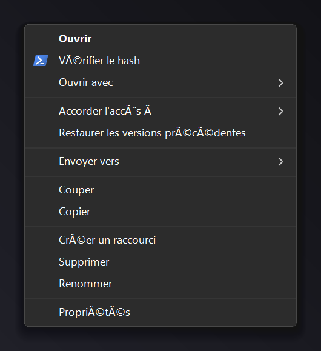
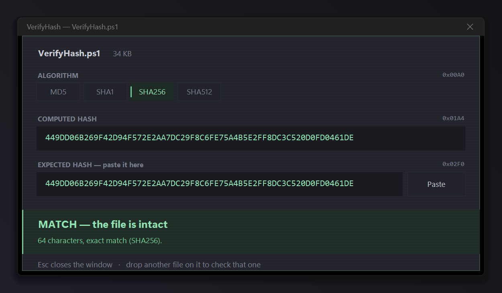
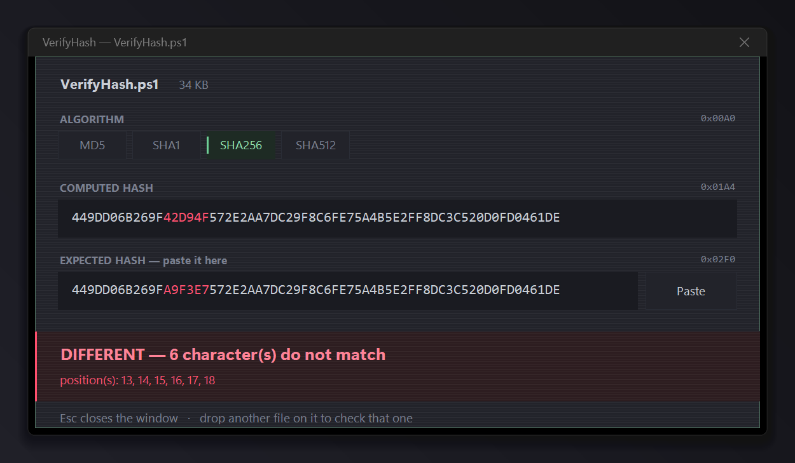

# VerifyHash

**Vérifiez un fichier téléchargé face au hash publié, depuis le menu
clic droit de Windows.** Un seul fichier PowerShell, sans dépendance, sans
droits administrateur.

*Read this in [English](README.md).*






## Le problème

Un site publie une somme de contrôle à côté de son téléchargement. Comparer
64 caractères hexadécimaux à l'œil est long et peu fiable — et l'œil est
justement le moins fiable là où ça compte, au milieu de la chaîne.

`Get-FileHash` donne la valeur, mais la comparaison reste à votre charge.
VerifyHash fait le tout : clic droit sur le fichier, collez le hash publié, le
bandeau passe au vert ou au rouge.

## Installation

### Option 1 — Téléchargement (recommandé)

1. Cliquez sur **Code → Download ZIP** en haut de cette page.
2. Extrayez le dossier là où il restera — l'entrée de menu pointera vers cet
   emplacement.
3. Double-cliquez sur **`VerifyHash.bat`**, puis sur **Installer**.

C'est tout. Le lanceur exécute le script avec un contournement de la stratégie
d'exécution : rien à débloquer, aucune stratégie à modifier.

### Option 2 — Clone

```powershell
git clone https://github.com/Defacedz/VerifyHash.git
cd VerifyHash
.\VerifyHash.ps1
```

### Lancer le .ps1 directement

Si vous préférez **Clic droit → Exécuter avec PowerShell** sur
`VerifyHash.ps1`, débloquez-le d'abord. Windows marque les fichiers venus
d'Internet et PowerShell refuse alors de les charger — la console affiche une
erreur rouge et se ferme aussitôt :

```powershell
Unblock-File .\VerifyHash.ps1
```

Ou clic droit sur le fichier → **Propriétés** → cocher **Débloquer** → OK.

## Utilisation

Clic droit sur n'importe quel fichier → **Vérifier le hash**.

> Sous Windows 11, l'entrée se trouve dans le menu complet, derrière
> **Afficher plus d'options** ou `Maj` + clic droit. Le menu compact de
> Windows 11 n'accepte que des entrées fournies par une application
> empaquetée, ce qu'un simple script ne peut pas être.

Collez la valeur publiée par l'éditeur dans le second champ. La comparaison se
fait au fil de la saisie, il n'y a pas de bouton à valider.

- **MD5, SHA-1, SHA-256, SHA-512.**
- **L'algorithme suit le hash collé.** Une valeur de 32 caractères bascule sur
  MD5, 40 sur SHA-1, 64 sur SHA-256, 128 sur SHA-512. Les boutons d'algorithme
  ne servent presque jamais.
- **Le texte collé est nettoyé.** Espaces, retours à la ligne et préfixes du
  type `SHA256:` sont ignorés, la casse est normalisée — copier une ligne
  entière depuis une page de téléchargement fonctionne.
- **Les écarts sont surlignés** dans les deux champs, avec leur position : de
  quoi distinguer un copier-coller tronqué d'un fichier réellement différent :

  
- **La fenêtre s'affiche immédiatement** et une barre suit la lecture du
  fichier, même sur plusieurs gigaoctets. Changer d'algorithme en cours de
  calcul annule et relance sans attendre.
- **Déposez un autre fichier sur la fenêtre** pour l'enchaîner.
- Un bandeau en bas passe au vert si les deux hashs correspondent, au rouge
  sinon — lisible à trois mètres.
- `Échap` ferme la fenêtre.

L'interface est en français sur un Windows français, en anglais sinon. Pour
forcer : `-Language fr` ou `-Language en`.

## Confidentialité

Le presse-papier n'est **jamais écrit** — le bouton **Coller** ne fait que le
lire. Aucun accès réseau, aucune télémétrie, aucun fichier créé. La seule
trace laissée sur la machine est une clé de registre sous
`HKEY_CURRENT_USER`.

## Désinstallation

Double-cliquez à nouveau sur `VerifyHash.bat` et cliquez sur **Désinstaller**.
La clé de registre est supprimée ; le dossier peut ensuite être effacé.

## Fonctionnement

- L'entrée de menu est une seule clé sous
  `HKEY_CURRENT_USER\Software\Classes\*\shell\VerifyHash`. Le `*` signifie
  « tous les types de fichiers ». Placée sous `HKCU` et non `HKLM`, elle ne
  concerne que votre compte et ne demande aucune élévation.
- Cette clé est écrite via l'API .NET `Microsoft.Win32.Registry` plutôt que
  par `New-Item` : le chemin contient un `*`, interprété comme un joker par le
  fournisseur Registry de PowerShell.
- L'entrée lance `conhost.exe --headless powershell.exe …`. `powershell.exe`
  est un programme console : Windows lui crée donc une fenêtre de console, et
  `-WindowStyle Hidden` ne fait que la masquer après coup — assez longtemps
  pour qu'un rectangle noir clignote à chaque utilisation. `--headless` donne
  au processus une pseudo-console sans aucune fenêtre, et l'interface
  s'affiche normalement.
- Le hachage lit le fichier par blocs de 4 Mo avec `TransformBlock`, en rendant
  la main à la boucle de messages entre deux blocs. C'est ce qui garde la
  fenêtre réactive sans second thread — et ce qui rend instantanée
  l'annulation d'un calcul de 10 Go.
- Le fichier est encodé en **UTF-8 avec BOM**. Windows PowerShell 5.1 ne
  détecte pas l'UTF-8 sans marqueur et afficherait les accents en caractères
  parasites. Conservez le BOM en cas de modification.

## Configuration requise

Windows 10 ou 11, Windows PowerShell 5.1 (livré avec Windows). Aucune
dépendance, aucun .NET à installer, aucun droit administrateur.

## Licence

MIT — voir [LICENSE](LICENSE).
